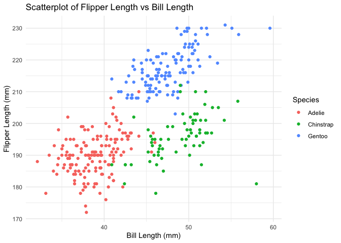

p8105_hw1_CY2772.Rmd
================
2024-09-20

Problem1

``` r
# Load the penguins dataset
data("penguins", package = "palmerpenguins")
# Assign number of rows and columns for inline reporting
n_rows = nrow(penguins)
n_cols = ncol(penguins)
mean_flipper_length = mean(penguins$flipper_length_mm, na.rm = TRUE)
```

Description of the Dataset:

The penguins dataset contains 344 rows and 8 columns. It includes data
on various characteristics of penguins, such as their species, island,
bill length, bill depth, flipper length, body mass, and sex.

One important variable, species, includes three values: “Adelie”,
“Chinstrap”, and “Gentoo”. Another variable of interest is
flipper_length_mm, which measures the penguin’s flipper length in
millimeters. The mean flipper length across all penguins in the dataset
is 200.92 mm.

``` r
library(ggplot2)

# Scatterplot of flipper length vs bill length
ggplot(penguins, aes(x = bill_length_mm, y = flipper_length_mm, color = species)) +
  geom_point() +
  labs(
    title = "Scatterplot of Flipper Length vs Bill Length",
    x = "Bill Length (mm)",
    y = "Flipper Length (mm)",
    color = "Species"
  ) +
  theme_minimal()
```

    ## Warning: Removed 2 rows containing missing values or values outside the scale range
    ## (`geom_point()`).

<!-- -->

``` r
# Save plot to file
ggsave("scatterplot_flipper_vs_bill.png", width = 6, height = 4)
```

    ## Warning: Removed 2 rows containing missing values or values outside the scale range
    ## (`geom_point()`).

Problem2

``` r
library(tidyverse)
```

    ## ── Attaching core tidyverse packages ──────────────────────── tidyverse 2.0.0 ──
    ## ✔ dplyr     1.1.4     ✔ readr     2.1.5
    ## ✔ forcats   1.0.0     ✔ stringr   1.5.1
    ## ✔ lubridate 1.9.3     ✔ tibble    3.2.1
    ## ✔ purrr     1.0.2     ✔ tidyr     1.3.1
    ## ── Conflicts ────────────────────────────────────────── tidyverse_conflicts() ──
    ## ✖ dplyr::filter() masks stats::filter()
    ## ✖ dplyr::lag()    masks stats::lag()
    ## ℹ Use the conflicted package (<http://conflicted.r-lib.org/>) to force all conflicts to become errors

``` r
#Create a random sample of size 10 from a standard Normal distribution
random_sample = rnorm(10)
#Create a  logical vector indicating whether elements of the sample are greater than 0
logical_vector = random_sample > 0
#Create a character vector of length 10
character_vector = c("A","B","C","D","E","F","G","H","I","J")
#Create a factor vector of length 10, with 3 different factor “levels”
factor_vector = factor(rep(c("low","medium","high"), length.out = 10))
# Combine into a data frame
hw1_df = data.frame(
  random_sample = random_sample,
  logical_vector = logical_vector,
  character_vector = character_vector,
  factor_vector = factor_vector
)
#Attempt to calculate the means for each variables
mean_random_sample = mean(hw1_df$random_sample)
mean_logical_vector = mean(hw1_df$logical_vector)
# mean_character_vector = mean(hw1_df$character_vector) #cause error
# mean_factor_vector = mean(hw1_df$factor_vector) #cause error

# Coerce character and factor variables to numeric
numeric_character_vector <- as.numeric(hw1_df$character_vector)
```

    ## Warning: NAs introduced by coercion

``` r
numeric_factor_vector <- as.numeric(hw1_df$factor_vector)
```
